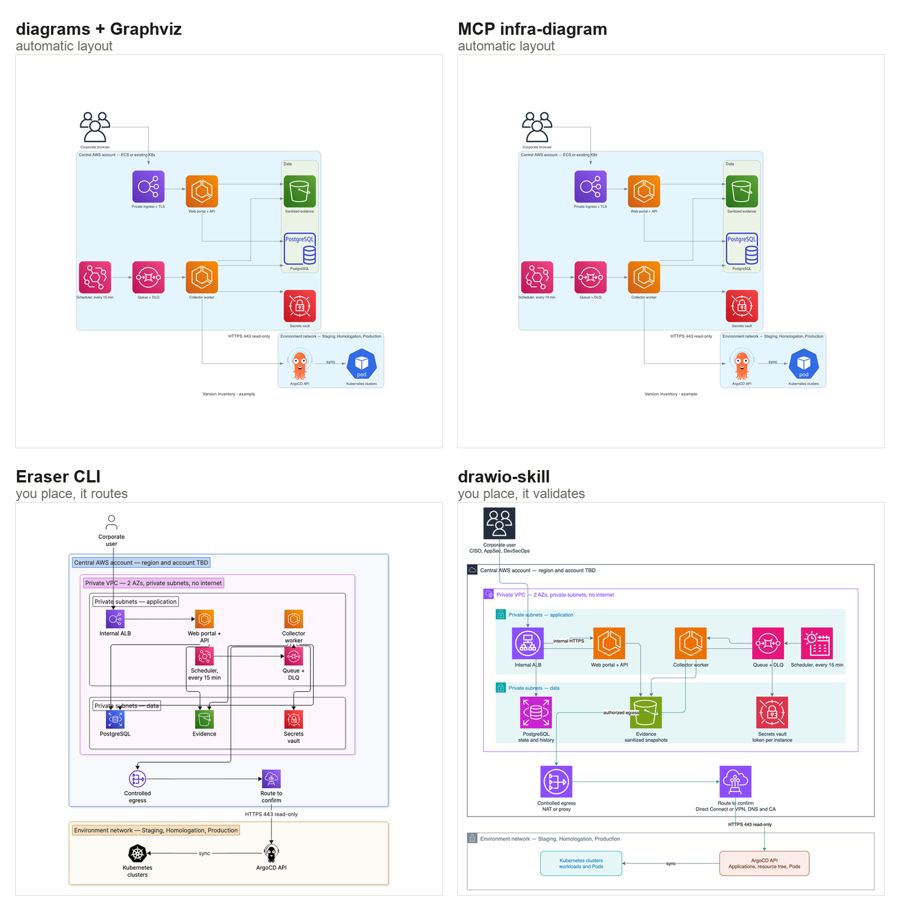
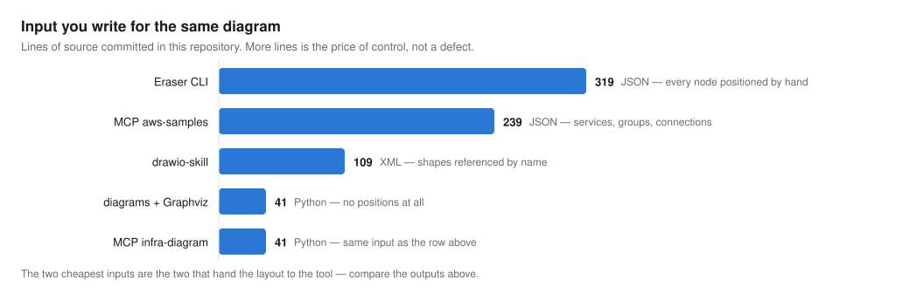

# skills-bench-for-diagrams

Cinco ferramentas desenharam o mesmo diagrama de arquitetura. Aqui está o que saiu, quanto
custou escrever cada um, e um comando que regera tudo.



As duas de cima decidiram o layout sozinhas. As duas de baixo receberam as posições do autor e
cuidaram do roteamento, dos ícones e da validação. Mesmo conteúdo, mesmo caso de teste, quatro
resultados.

[Read in English](README.md) — o conteúdo do repositório está em inglês; este é o único
documento em português.

## O desenho que todas fizeram

Um sistema fictício de inventário de versões: uma conta AWS central com VPC privada em duas
zonas de disponibilidade, portal e worker de coleta em subnets de aplicação, banco, evidências
e cofre de segredos em subnets de dados, saída controlada e, fora da conta, a rede de cada
ambiente — Staging, Homologation e Production — com ArgoCD e clusters Kubernetes.

**É um caso de teste, não uma arquitetura de referência.** Foi escrito para exercitar o que
diferencia as cinco: containers aninhados, ícones de fornecedor, rótulo em aresta e elementos
deliberadamente indefinidos. O nó "route to confirm" está ali de propósito, para mostrar como
marcar o que ainda não foi decidido.

## Resultado

| Ferramenta | Quem decide o layout | Saída | Editável | Funciona offline | Licença |
| --- | --- | --- | --- | --- | --- |
| [`diagrams`](https://github.com/mingrammer/diagrams) + Graphviz | a ferramenta | PNG, SVG | não | sim | MIT |
| [MCP infra-diagram](https://github.com/andrewmoshu/diagram-mcp-server) | a ferramenta | PNG, `.drawio` | sim | sim | Apache-2.0 |
| [MCP aws-samples](https://github.com/aws-samples/sample-architecture-diagram-mcp-server) | a ferramenta (ELK) | HTML interativo, `.drawio` | sim | sim | MIT-0 |
| [Eraser CLI](https://github.com/eraserlabs/eraser-diagrams) | você, com roteamento automático | PNG, HTML | não | **não** — busca ícones | MIT |
| **[drawio-skill](https://github.com/Agents365-ai/drawio-skill)** | **você, com validação** | **`.drawio`, PNG, SVG, HTML, PPTX** | **sim** | **sim** | **MIT** |



A `drawio-skill` ganha nos dois eixos ao mesmo tempo: um terço da entrada do Eraser, e é a única
que traz um validador — sobreposições, cruzamentos e arestas atravessando caixas, contados. O
diagrama versionado marca 0. E o `.drawio` dela tem 11 KB contra os 292 KB do convertido a
partir do Graphviz, porque referencia as formas pelo nome em vez de embutir cada ícone em
base64.

Método, achados por ferramenta, medições e diferenças de plataforma:
**[benchmark-diagrams/](benchmark-diagrams/)**

## Reproduzindo

Tudo que está em `benchmark-diagrams/results/` é regerado por um comando, a partir das
entradas versionadas ao lado de cada resultado.

No container, que é o único caminho que não exige nada instalado:

```bash
docker build -t skills-bench-for-diagrams . && docker run --rm -t \
  -v "$PWD/benchmark-diagrams/results:/app/benchmark-diagrams/results" skills-bench-for-diagrams
```

Direto na máquina:

```bash
./benchmark-diagrams/install.sh && ./benchmark-diagrams/bench.sh
```

O `install.sh` clona cada ferramenta no commit em que foi testada e fixa as versões de pacote.
O `bench.sh` roda os cinco, cronometra cada um e termina imprimindo as dimensões medidas de
cada artefato. Teste sem dependência é pulado com o motivo, em vez de derrubar a execução.

## As skills

Seis skills acompanham o benchmark: uma por ferramenta, uma otimizada sobre a vencedora e uma de
vinte linhas para validar um runtime novo. São diretórios com um `SKILL.md`, funcionam com
qualquer modelo e qualquer runtime de agente — e há um loader de referência de sessenta linhas
para provar.

**[skills-architecture-diagrams/](skills-architecture-diagrams/)**

## Quem mantém

Feito e mantido por David Faustino, engenheiro de computação com atuação em segurança de
aplicações e cloud, inteligência artificial e arquitetura de software.

Meu trabalho conecta engenharia de segurança e governança: traduzir riscos e requisitos em
decisões de arquitetura, controles automatizados e evidências que apoiem as decisões dos
times. Nessa atuação, combino experiência em desenvolvimento e plataformas com a construção e
avaliação de soluções de IA.

Atuo em quatro frentes complementares:

- IA aplicada à segurança — integração de modelos aos testes de segurança e à análise de
  achados de código, dependências, aplicações e runtime, apoiando investigação, priorização e
  correção com validação dos resultados e supervisão humana.
- Arquitetura e governança de segurança — desenvolvimento seguro (SSDLC), gestão de
  vulnerabilidades e controles em aplicações e cloud, conectando decisões técnicas,
  priorização por risco e evidências para conformidade e auditoria.
- Engenharia e avaliação de IA — infraestrutura e orquestração de agentes, skills, servidores
  MCP e avaliação de modelos de pesos abertos, sobre uma base anterior de machine learning.
  Qualidade, confiabilidade, custo e limites de uso orientam as decisões de adoção.
- Engenharia de capacidades de segurança e DevSecOps — desenvolvimento de operators,
  bibliotecas, integrações e automações para aplicações e ambientes cloud, incluindo gestão do
  ciclo de vida de certificados. Integração de análise, testes e proteção — SAST, SCA, DAST,
  IAST, RASP e sensores de runtime — do desenvolvimento à operação. Uso de CI/CD, GitOps,
  Kubernetes e AWS para transformar requisitos de segurança em capacidades reutilizáveis por
  diferentes times.

Este projeto faz parte dessa prática: compartilhar implementações, métodos e resultados para
que decisões técnicas possam ser examinadas, reproduzidas e aprimoradas pela comunidade.

Dúvidas, correções e resultados de outras ferramentas são bem-vindos. Abra uma issue neste
repositório ou entre em contato pelo e-mail
[davidfaustinoeng@gmail.com](mailto:davidfaustinoeng@gmail.com).

## Licenças

Este repositório é MIT. As ferramentas comparadas **não** estão aqui: cada uma é clonada da
origem, no commit testado. A única exceção é a skill otimizada, que leva três scripts MIT e um
índice de formas Apache 2.0 para funcionar sem instalar a skill original. Toda a procedência,
com a modificação aplicada, está em `NOTICE.md`.

Nenhum pacote de ícones é redistribuído. Os termos da AWS permitem usar os ícones em diagramas
de arquitetura — que é o que os PNG versionados fazem — mas não redistribuir o acervo.

Uma das ferramentas citadas, uma skill popular de Excalidraw, não declara licença. Sem licença
declarada não pode ser redistribuída, então aparece como referência, sem cópia.
